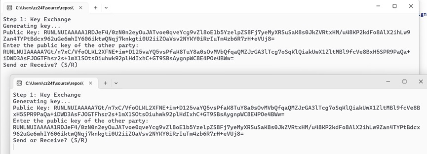
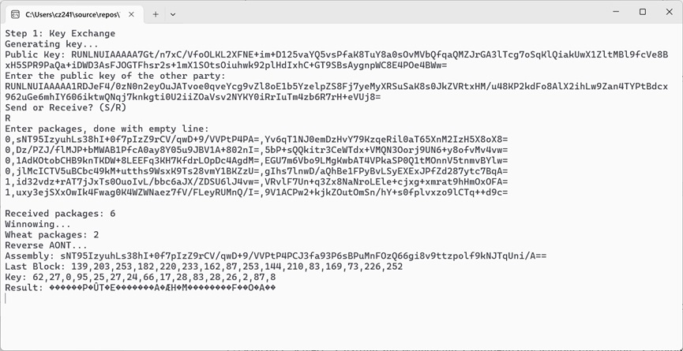
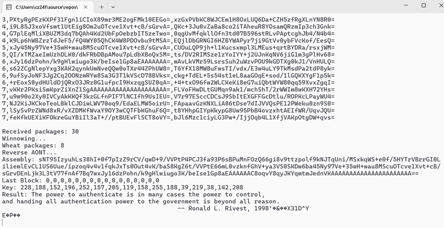

<p style="text-indent: 2em;">
最近在Crypto 2023上看到一篇有趣的文章<sup>[1]</sup>,其旨在一个存在拥有所有密钥并知道所有消息的“独裁者”的信道中，通过安排与常规密文无法区分的隐藏的“变形”消息来进行机密通信的方法——变形签名，但由于本人技术水平有限无法完整实现整个系统。而当阅读到其中的一个技术分支——Chaffing and Winnowing时惊喜地发现其实现方法之巧妙，又恰好在图灵班的密码学课程中学到了相关的Diffie-Hellman密钥交换协议和消息验证码MAC等知识，于是选取这篇上世纪的论文<sup>[2]</sup>来进行评论和仿真实验。
</p>

<p style="text-indent: 2em;">
（是的你没看错，这是我在学校写的某低水平评论论文，觉得方法比较新颖巧妙，于是分享出来）
</p>

<p align="center">
摘要： 本文介绍了 Rivest 提出的 Chaffing and Winnowing 技术，该技术通过在消息中混入无关信息 (chaff) 并添加认证码 (MAC) 来实现机密性，即使在拥有所有加密密钥的“独裁者”信道中进行通信也能保证消息安全。文章详细阐述了该技术的原理、应用场景、潜在威胁以及未来研究方向，并通过实验仿真实现了整个技术流程。
</p>

## 一、简介
<p style="text-indent: 2em;">
Rivest为我们介绍了一种新技术Chaffing and Winnowing——原意是指从谷粒中分离谷壳的过程，它不进行传统意义上的加密，而是将消息（wheat）分块并作认证，混入无关信息（chaff）之后再进行通信。
</p>
<p style="text-indent: 2em;">
该项技术可以说是变形签名<sup>[1]</sup>的奠基之作，二者同样考虑一个问题：若独裁者拥有一个“后门”能够恢复密钥来对消息进行解密，那么如何在这样的信道上为消息提供机密性。Rivest说“像往常一样，关于规范技术的政策辩论最终会被技术创新所淘汰。试图通过规范加密来规范保密性，关闭了一扇门，却留下了另外两扇门（隐写术和Chaffing and Winnowing）.”后者与前者不同，隐写术<sup>[3]</sup>注重于在较大的、看似普通的信息（如图片）中隐藏机密，使得在算法不公开的前提下，一个PPT敌手无法有效区分机密内容和普通内容。显然这样的机密性是由算法保密性提供，并不符合卡尔霍夫原则<sup>[4]</sup>，即“一个密码系统的安全性不应依赖于算法的秘密性，而应依赖于密钥的秘密性”。
</p>
<p style="text-indent: 2em;">
　　而在Chaffing and Winnowing中，消息机密性的保证被归因到MAC算法的认证性上，即在适应性选择明文攻击下具有存在不可伪造性<sup>[5]</sup>。对手无法怀疑两种数据包的存在，不具有机密认证则亦无法区分它们，即使原消息不受任何加密。
</p>

## 二、技术概要
<p style="text-indent: 2em;">
原文中，作者循序渐进地介绍了这种技术的原理。
</p>
<p style="text-indent: 2em;">
总体而言，发送方与接收方共享一个密钥，发送消息有两个部分：认证（添加消息认证码MAC）和添加chaff；接收方会通过验证MAC去除chaff（这个过程称为“winnowing”）以获得原始消息。整个过程中，没有对任何东西进行加密，因此可能不受出口管制（MAC不是加密）。
</p>
<p style="text-indent: 2em;">
这是一个十分原始的想法，而后作者在考虑了实际运用的问题并做出诸多改进措施。
</p>

- 消息包的拆分与组装中，定义一个消息包为包含序列号、消息和MAC的三元组，以便接收方除重、组装和识别丢失。并在这里提出一种优化：发送方按顺序发送包，接收方一旦验证成功该序列号，则丢弃后续所有相同序列号的包。
- 一个良好的混淆过程会为消息使用的每一个序列号至少添加一个chaff。
- 对手可能通过每个包裹的内容来区分chaff和wheat，无限拆分wheat只会让传输更加低效。
<p style="text-indent: 2em;">
为了解决以上问题，作者引用了自己的一项技术——全或无加密和包变换<sup>[11]</sup>。简单来说，通过这种变换之后，只有接收者收到全部消息才可逆转变换得到原文，否则只能得到垃圾消息。（让我们把算法具体实现放在仿真实验的部分。）使用此变换后，再对消息进行分包签名和发送，能够减少敌手直接通过辨识消息来查找wheat组合的机会。
</p>

## 三、研究分类、现状、难点分析与未来方向
<p style="text-indent: 2em;">
我们现在已经了解到Chaffing and Winnowing技术的原理，可以发现数据包被分为了两种——为己用和混淆视听。前者的用法似乎已经固定，后者则隐藏着更大的利用潜能与危机。
</p>

#### 1. 可否认加密<sup>[6]</sup>
<p style="text-indent: 2em;">
如果对于每个wheat消息包，都生成一个使用特定密钥MAC认证的chaff，该chaff实际包含无害的消息，当使用该特定密钥进行认证时只能得到无害的消息，而真正在通讯双方交流的内容则被视为垃圾。如此使得在没有正确的解密密钥的情况下无法证明明文消息的来源或存在，即可否认加密。缺点在于，如果暴力机关要求通讯者提供所有密钥，则始终无法证明其是否已经提供全部密钥。
</p>

#### 2. 防止流量分析
<p style="text-indent: 2em;">
我尚未查找到已有的研究，只有维基百科中提及该技术的变体能够在分组网络中防止消息泄露和流量分析<sup>[7]</sup>。
</p>

#### 3. 潜在的诬陷攻击
<p style="text-indent: 2em;">
试想通讯双方之间存在一个发起中间人攻击的主动敌手，能够用自己的密钥生成MAC并嵌入有害信息，这对于通讯双方接受消息没有影响。此时敌手拥有通讯的全文和自己的密钥，则他可以对通信双方进行诬陷：指定其通讯内容为有害信息而他们无法辩解。一方面，由于可否认加密的存在，他们可被认定为提供虚假无害的消息密钥；另一方面，通讯双方根本没有机密性需求，也没有使用Chaffing and Winnowing技术，他们本身就没有密钥，敌手嵌入的信息在通讯双方的可忽视区内。
</p>

#### 4. 如何协商一个私钥
<p style="text-indent: 2em;">
原文中仅用一个段落草草带过双方协商密钥的过程——“例如”使用Diffie-Hellman密钥交换协议<sup>[8]</sup>,即通讯双方交换对方的公钥与自己的私钥计算得到共有的密钥。然而原始的协议仅在窃听敌手存在的情况下是安全的，通讯双方并不知道对方的身份，如果要抵御主动攻击敌手，则需要涉及数字证书和指定验证者签名<sup>[9]</sup>等技术。这不在作者Rivest讨论的范围内，因为他的安全目标规定独裁者只知道加密密钥，而不限制认证。
</p>

#### 5. 消息体积剧增与对抗暴力枚举
<p style="text-indent: 2em;">
通讯双方仍需发送足够量的chaff包以迷惑敌手，使之在计算上找到包的组合不可行。这也无疑增大了包的体积，加之需要足够长度的MAC对抗碰撞。
</p>

　　目前该技术亟需解决的问题个人认为就是以上的3、4、5点；由此技术衍生的变形加密和变形签名相关研究已连续两年在CRYPTO发表<sup>[1][10]</sup>。

## 四、实验仿真
以下使用C# .NET 9 on Windows平台进行实验，模拟通讯双方使用Chaffing and Winnowing技术的全部过程。

#### 1. 通讯双方协商密钥
生成ECDiffieHellmanCng实体并生成密钥对，输出公钥，要求输入私钥后计算共同密钥：

```cs
Console.WriteLine("Step 1: Key Exchange");
Console.WriteLine("Generating key...");
using var client = new ECDiffieHellmanCng()
{
    KeyDerivationFunction = ECDiffieHellmanKeyDerivationFunction.Hash,
    HashAlgorithm = CngAlgorithm.Sha256
};
var publicKey = client.PublicKey.ToByteArray();
Console.WriteLine($"Public Key: {Convert.ToBase64String(publicKey)}");
Console.WriteLine("Enter the public key of the other party:");
string otherKey = Console.ReadLine();
byte[] otherPublicKey = Convert.FromBase64String(otherKey);
var privateKey = client.DeriveKeyMaterial(CngKey.Import(otherPublicKey, CngKeyBlobFormat.EccPublicBlob));
```
 

#### 2. 实现一个AONT变换

　　这里采用原作者的简单变换：将数据按BLOCK_SIZE分块，生成与块等大的随机生成的密钥块key，将每个数据块与key逐比特异或得到结果，再将key与结果做异或储存在结果的最后一块之后：

```cs
public static readonly int BLOCK_SIZE = 16;
    public static byte[] Transform(byte[] data){
        int blocks= (data.Length+BLOCK_SIZE-1)/BLOCK_SIZE;
        byte[] result = new byte[(blocks+1)*BLOCK_SIZE];//reserve one block for the hash
        byte[] key= new byte[BLOCK_SIZE];
        RandomNumberGenerator.Fill(key);

        Console.WriteLine($"Key: {string.Join(',',key)}");

        for(int i=0;i<blocks;i++){
            int offset = i*BLOCK_SIZE;
            for(int j=0;j<BLOCK_SIZE&&offset+j<data.Length;j++){
                result[offset+j]=(byte)(data[offset+j]^key[j]);
            }
        }

        for(int i=0;i<blocks*BLOCK_SIZE;i++){
            key[i%BLOCK_SIZE]^=result[i];  //key XOR with data blocks
        }
        Array.Copy(key,0,result,blocks*BLOCK_SIZE,BLOCK_SIZE);
        
        Console.WriteLine($"Last Block: {string.Join(',',key)}");

        return result;
    }
```

　　逆变换即先按BLOCK_SIZE分块，取出最后一块，依次与数据块做异或，解出key，再用key与数据块做异或还原原始数据。（注意，后续分包时，包的大小应该为BLOCK_SIZE的整数倍，以确保key按照相同的方式还原；逆变换时可能发现最后一块为{0}*，这并不影响解除key，因为与0异或为其本身。）

```cs
public static bool Reverse(byte[] data,out byte[] result){
    if(data.Length%BLOCK_SIZE!=0){
        result=null;
        return false;
    }

    int oriBlocks = data.Length/BLOCK_SIZE-1;
    result= new byte[oriBlocks*BLOCK_SIZE];

    byte[] key= new byte[BLOCK_SIZE];
    Array.Copy(data,oriBlocks*BLOCK_SIZE,key,0,BLOCK_SIZE);
    Console.WriteLine($"Last Block: {string.Join(',',key)}");
        
    for(int i=0;i<oriBlocks*BLOCK_SIZE;i++){
        key[i%BLOCK_SIZE]^=data[i];  //key XOR with data blocks
    }
    Console.WriteLine($"Key: {string.Join(',',key)}");

    for(int i=0;i<oriBlocks;i++){
        int offset = i*BLOCK_SIZE;
        for(int j=0;j<BLOCK_SIZE&&offset+j<result.Length;j++){
            result[offset+j]=(byte)(data[offset+j]^key[j]);
        }
    }

    return true;
}
```
　　以上，如果不首先访问消息的每个块，就不可能恢复原始明文。

　　有后人使用更复杂的算法实现AONT，例如使用线性变换而无任何加密假设的Stinson 算法<sup>[12]</sup>。似乎能提供更高的安全性。

　　调用ANOT变换，这里预先设定了发送的消息。

```cs
Console.WriteLine("Step 2: AONT");
string content = """
    The power to authenticate is in many cases the power to control, 
    and handing all authentication power to the government is beyond all reason. 
                                                    -- Ronald L. Rivest, 1998
    """;
byte[] dataBytes = Encoding.UTF8.GetBytes(content);
byte[] transformed = AONT.Transform(dataBytes);
```
 

#### 3. 创建MAC消息验证码

　　这里使用HMAC-SHA256算法<sup>[13][14]</sup>给出简单的MAC算法三元组，其中Gen已由最初的密钥交换提供。

```cs
    public static byte[] Sign(byte[] key,byte[] data){
        using var hmac = new HMACSHA256(key);
        return hmac.ComputeHash(data);
    }
    public static bool Verify(byte[] key,byte[] data,byte[] signature){
        using var hmac = new HMACSHA256(key);
        byte[] computed = hmac.ComputeHash(data);
        return computed.Length==signature.Length&&computed.AsSpan().SequenceEqual(signature);
    }
```
 

#### 4. 分包和签名

```cs
Console.WriteLine("Step 3: Packaging and Signing");
int numBlocks = (transformed.Length + BLOCK_SIZE - 1) / BLOCK_SIZE;
List<Package> packages = [];
for (int index = 0; index < numBlocks; index++)
{
    int offset = index * BLOCK_SIZE;
    int blockSize = Math.Min(BLOCK_SIZE, transformed.Length - offset);
    byte[] block = new byte[BLOCK_SIZE];
    Array.Copy(transformed, offset, block, 0, blockSize);

    byte[] signature = HMACHelper.Sign(privateKey, block);
    packages.Add(new Package(index, block, signature));
}
int packageCount = packages.Count;
Console.WriteLine($"Wheat packages: {packageCount}");
```
 

#### 5. 加入带有随机数据的chaff

```cs
Console.WriteLine("Step 4: Adding Chaff Packages");
var rand = new Random();
for (int i = 0; i < packageCount; i++)
{
    int randCount = rand.Next(1, 5);
    for (int j = 0; j < randCount; j++)
    {
        var randData = new byte[BLOCK_SIZE];
        RandomNumberGenerator.Fill(randData);
        var randSignature = new byte[32];
        RandomNumberGenerator.Fill(randSignature);
        packages.Add(new Package(i, randData, randSignature));
    }
}
var sendPkg = packages.OrderBy(p => p.index);
```
 

#### 6. 模拟发送

　　将所有的包按照index顺序排列后以Base64编码输出模拟发送，在接收端输入内容模拟接收。Base64编码能将byte[]转为文本格式，便于实验。

```cs
Console.WriteLine("Step 5: Sending Packages");
foreach (var pkg in sendPkg)
{
    Console.WriteLine($"{pkg.index},{Convert.ToBase64String(pkg.data)},{Convert.ToBase64String(pkg.signature)}");
}
Console.ReadLine();
```
#### 7. 模拟接收

　　要求输入所有的包，键空以结束。

```cs
Console.WriteLine("Enter packages, done with empty line:");
List<Package> received = [];
 try
{
      while (true)
      {
           string line = Console.ReadLine();
            if (string.IsNullOrEmpty(line)) break;
            string[] parts = line.Split(',');
            int index = int.Parse(parts[0]);
            byte[] data = Convert.FromBase64String(parts[1]);
            byte[] signature = Convert.FromBase64String(parts[2]);
            received.Add(new Package(index, data, signature));
      }
        Console.WriteLine($"Received packages: {received.Count}");
}
catch
{
     Console.WriteLine("Invalid input.");
     continue;
}
```
 

#### 8. Winnowing和逆变获得原消息

```cs
Console.WriteLine("Winnowing...");
        var wheat = received.Where(p => HMACHelper.Verify(privateKey, p.data, p.signature)).OrderBy(p => p.index).ToList();
        var wheatCount = wheat.Count;
        Console.WriteLine($"Wheat packages: {wheatCount}");

        Console.WriteLine("Reverse AONT...");
        byte[] assembly = new byte[wheatCount * BLOCK_SIZE];
        for (int i = 0; i < wheatCount; i++)
        {
            Array.Copy(wheat[i].data, 0, assembly, i * BLOCK_SIZE, BLOCK_SIZE);
        }
        Console.WriteLine($"Assembly: {Convert.ToBase64String(assembly)}");
        if (AONT.Reverse(assembly, out byte[] result))
        {
            Console.WriteLine($"Result: {Encoding.UTF8.GetString(result)}");
        }
        else
        {
            Console.WriteLine("Reverse failed.");
        }
```
 

#### 9. 测试

　　两实例交换公钥并在内部生成私钥：


　　发送方生成消息包：


　　接收方收到不完整包流，逆变得到乱码；如果接受不完整块流，逆变将失败：

 

　　只有完整获得包流才能解出原始信息：

 

:::note[MY CUSTOM TITLE]  
注释：为了方便起见，这里没有处理原消息长度，padding产生的字节被编为乱码。  
　　　在实际运用中，包的结构并非像实验中一样直接暴露。  
　　　以上实验项目代码在Github上由本人公开。  
:::
::github{repo="TwilightLemon/TestCWCrypto"}

## 五、结论
　　Chaffing and Winnowing 技术提供了一种非传统的思路，利用 MAC 的认证性为消息提供机密性保障，即使在拥有所有加密密钥的信道中也能保证消息安全。该技术具有潜在的应用价值，但仍需解决一些挑战，例如协商私钥的安全性和消息体积的膨胀。未来研究可以探索更复杂的混淆过程、更高效的压缩算法以及更安全的密钥协商协议，以进一步提升 Chaffing and Winnowing 技术的安全性、效率和实用性。

## 参考文献 
[1] Kutyłowski, M., Persiano, G., Phan, D.H., Yung, M., Zawada, M. (2023). “Anamorphic Signatures: Secrecy from a Dictator Who Only Permits Authentication!”. In: Handschuh, H., Lysyanskaya, A. (eds) Advances in Cryptology – CRYPTO 2023. Lecture Notes in Computer Science, vol 14082. Springer, Cham. https://doi.org/10.1007/978-3-031-38545-2_25

[2] Ronald L. Rivest. “Chaffing and Winnowing: Confidentiality without Encryption”. Cryptobytes, Summer 1998. MIT Laboratory for Computer Science. Web. 23 Nov. 2024. https://people.csail.mit.edu/rivest/pubs/Riv98a.pdf

[3] Peter Wayner. 1996. “Disappearing cryptography: being and nothingness on the net”. Academic Press Professional, Inc., USA. https://dl.acm.org/doi/10.5555/229879

[4] Kerckhoffs, A. (1883). “La cryptographie militaire”. Journal des sciences militaires. https://www.petitcolas.net/kerckhoffs/crypto_militaire_1.pdf

[5] Krawczyk, H., Bellare, M., and R. Canetti, “HMAC: Keyed-Hashing for Message Authentication”, RFC2104, February 1997.  https://www.rfc-editor.org/rfc/rfc2104

[6] Canetti, Ran, Cynthia Dwork, Moni Naor, and Rafail Ostrovsky, “Deniable Encryption”, Proceedings CRYPTO ’97 (Springer 1997). https://link.springer.com/content/pdf/10.1007/BFb0052229.pdf

[7] Chaffing and Winnowing – Variations WikiPedia. https://en.wikipedia.org/wiki/Chaffing_and_winnowing#Variations

[8] Diffie, Whitfield; Hellman, Martin E. (November 1976). “New Directions in Cryptography”. IEEE Transactions on Information Theory. https://ee.stanford.edu/~hellman/publications/24.pdf

[9] Jakobsson, Markus, Kazue Sako, and Russell Impagliazzo, “Designated Verifier Proofs and Their Applications’’, Pro-ceedings Eurocrypt ’ 96 (Springer 1996), 143—154. https://link.springer.com/content/pdf/10.1007/3-540-68339-9_13.pdf

[10] Persiano, G., Phan, D.H., Yung, M. (2022). “Anamorphic Encryption: Private Communication Against a Dictator”. In: Dunkelman, O., Dziembowski, S. (eds) Advances in Cryptology – EUROCRYPT 2022. EUROCRYPT 2022. Lecture Notes in Computer Science, vol 13276. Springer, Cham. https://doi.org/10.1007/978-3-031-07085-3_2

[11] Rivest, R. “All-Or-Nothing Encryption and the Package Transform”. Proceedings of the 1997 Fast Software Encryption Conference (Springer, 1997). https://people.csail.mit.edu/rivest/pubs/Riv97d.pdf

[12] Stinson, D.R. “Something About All or Nothing (Transforms)”. Designs, Codes and Cryptography 22, 133–138 (2001). https://link.springer.com/article/10.1023/A:1008304703074

[13] HMACSHA256 Class (System.Security.Cryptography) | Microsoft Learn. https://learn.microsoft.com/en-us/dotnet/api/system.security.cryptography.hmacsha256

[14] Preneel, B. (2024). “HMAC”. In: Jajodia, S., Samarati, P., Yung, M. (eds) Encyclopedia of Cryptography, Security and Privacy. Springer, Berlin, Heidelberg. https://doi.org/10.1007/978-3-642-27739-9_581-2

[15] Siriwardena, P. (2020). “Base64 URL Encoding”. In: Advanced API Security. Apress, Berkeley, CA. https://doi.org/10.1007/978-1-4842-2050-4_20