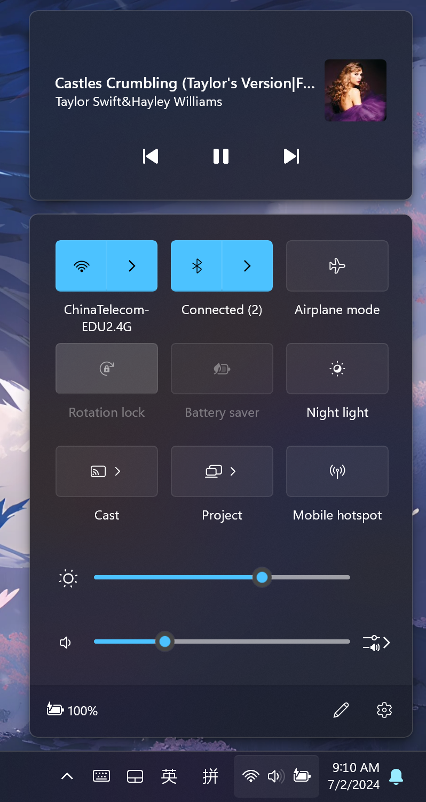
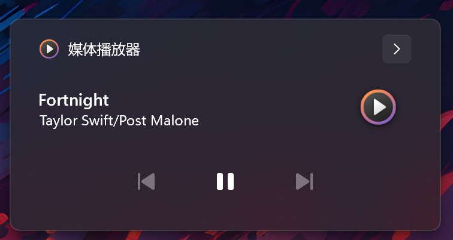
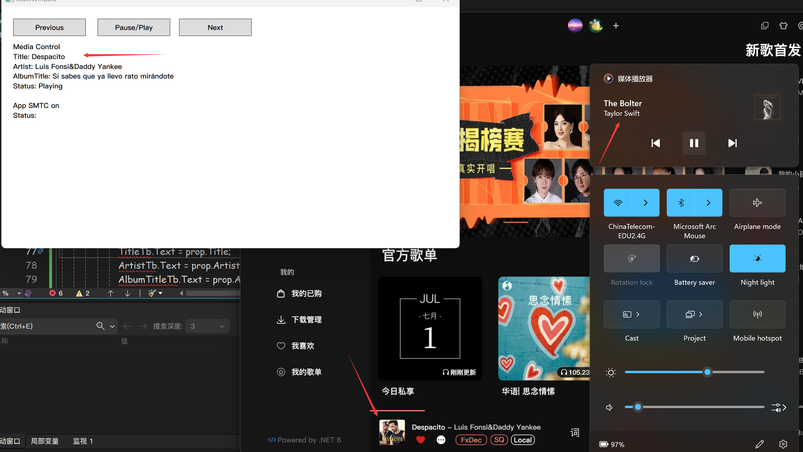

当你使用Edge等浏览器或系统软件播放媒体时，Windows控制中心就会出现相应的媒体信息以及控制播放的功能，如图。  

:::note[WHAT IS SMTC]
`SMTC (SystemMediaTransportControls)` 是一个Windows App SDK (旧为UWP) 中提供的一个API，用于与系统媒体交互。接入SMTC的好处在于，将媒体控制和媒体信息共享给系统，使用通用的特性（例如接受键盘快捷键的播放暂停、接受蓝牙设备的控制），便于与其它支持SMTC的应用交互等。
:::
在UWP App中使用它很简单，只需要调用`SystemMediaTransportControls.GetForCurrentView()`方法即可，但是该方法仅限在有效的UWP App中调用，否则将抛出`“Invalid window handle”`异常。实际上，在官方文档中提到所有`XXXForCurrentView`方法均不适用于UWP App以外的程序调用。  

> 这些`XxxForCurrentView`方法对`ApplicationView`类型具有隐式依赖关系，桌面应用不支持该类型。由于桌面应用不支持 `ApplicationView`，因此也不支持任何`XxxForCurrentView`方法。  

此外官方文档还给出一个可替代的接口`ISystemMediaTransportControlsInterop`，然而这个接口在给的SDK中有保护性，无法访问。  

至此，直接创建SMTC的方法走不通。但是我发现一个奇怪的地方，UWP提供的在`Windows.Media.Playback`命名空间下的`MediaPlayer`可以和SMTC自动集成，并且可以通过`SystemMediaTransportControls`属性直接拿到SMTC对象。MediaPlayer内部通过某种COM组件直接创建了该NativeObject，而没有走API提供的`GetForCurrentView`或`FromAbi`方法。也就是说，SMTC组件其实不需要使用合法的UWP Window句柄来创建，只不过可能为了某些特性而加上了该限制(后文将提到)。幸运的是，`MediaPlayer`帮我们绕过了这点。  

下文讲解手动与SMTC交互而不是直接使用MediaPlayer进行播放，你的项目可能已经有了其它的解码器(如WPF版本的MediaPlayer、Bass.Net解码器、NAudio等)，则只需要将交互部分接入SMTC而不更换解码器。  

文末提供了我封装好的`SMTCCreator`和`SMTCListener`，可以直接使用。  

## 一、引用WinRT API到项目
  最便捷的方法是直接修改目标框架到win10，这样就能自动引入WinRT API:  
```xml
<TargetFramework>net8.0-windows10.0.19041.0</TargetFramework>
```
或者一些其他的方法，可以参考这篇博客：[如何在WPF中调用Windows 10/11 API(UWP/WinRT) - zhaotianff - 博客园 (cnblogs.com)](https://www.cnblogs.com/zhaotianff/p/17320807.html)

## 二、通过MediaPlayer获取SMTC对象
```csharp
using Windows.Media;
using Windows.Storage.Streams;
...
private readonly Windows.Media.Playback.MediaPlayer _player = new();
private readonly SystemMediaTransportControls _smtc;
...
//先禁用系统播放器的命令
_player.CommandManager.IsEnabled = false;
//直接创建SystemMediaTransportControls对象被平台限制，神奇的是MediaPlayer对象可以创建该NativeObject
_smtc = _player.SystemMediaTransportControls;
//启用smtc以进行自定义
_smtc.IsEnabled = true;
```
拿到SMTC对象之后的操作与UWP中无异，这里简单看一下：  

### 1.设置可交互性
```csharp
_smtc.IsPlayEnabled = true;
_smtc.IsPauseEnabled = true;
_smtc.IsNextEnabled = true;
_smtc.IsPreviousEnabled = true;
```
### 2.设置媒体信息

```csharp
var updater = _smtc.DisplayUpdater;
updater.AppMediaId = "xxx"; //用于区分不同来源的媒体
updater.Type = MediaPlaybackType.Music; //必须指定媒体类型否则抛异常
updater.MusicProperties.Title = “Title”；//标题
/*...省略相同的字段设置...*/
updater.Thumbnail = RandomAccessStreamReference.CreateFromUri(new Uri(ImgUrl));//设置封面图
updater.Update();//最后调用以生效
```

播放状态需要单独设置:
```csharp
_smtc.PlaybackStatus = MediaPlaybackStatus.Playing; //Paused \ Stopped
//直接设置无需更新
```

### 3.响应SMTC交互
```csharp
_smtc.ButtonPressed += _smtc_ButtonPressed;
...
 private void _smtc_ButtonPressed(SystemMediaTransportControls sender, SystemMediaTransportControlsButtonPressedEventArgs args)
        {
            switch(args.Button)
            {
                case SystemMediaTransportControlsButton.Play:
                    //Play
                    break;
                case SystemMediaTransportControlsButton.Pause:
                    //Pause
                    break;
                case SystemMediaTransportControlsButton.Next:
                    //Next
                    break;
                case SystemMediaTransportControlsButton.Previous:
                    //Previous
                    break;
            }
        }
```

注意，文中所有SMTC的事件均由系统触发，意味着非同一线程，需要用Dispatcher来操作UI  

## 三、获取和控制系统媒体
好消息是，负责这部分的模块`GlobalSystemMediaTransportControlsSession`公开可以任意使用，不受UWP平台限制。  

### 1.获取媒体信息
```csharp  
var gsmtcsm = await GlobalSystemMediaTransportControlsSessionManager.RequestAsync();//获取SMTC会话管理器
gsmtcsm.CurrentSessionChanged += xxx; //当前会话改变或退出时发生，微软对CurrentSession的解释是用户可能最希望控制的媒体会话，实测为Windows控制中心顶部显示的媒体，当有多个媒体时用户可以在此选择切换
...
var session = gsmtcsm.GetCurrentSession();
if(session == null)
    return; //当前没有注册的SMTC会话

//接下来操作session即可，下面仅提供参考信息

//媒体信息改变时发生，奇怪的是这些事件提供的参数e并没有任何信息
session.MediaPropertiesChanged += async (sender, e)=>{
    //触发事件时主动拉取信息
    var info = await _globalSMTCSession.TryGetMediaPropertiesAsync();
};
//播放状态改变时发生
session.PlaybackInfoChanged +=(sender,e)=>{
    var status = globalSMTCSession.GetPlaybackInfo().PlaybackStatus;
};
```
### 2.控制媒体播放
直接调用即可  
```csharp
await session.TryPauseAsync();
await session.TryPlayAsync();
await session.TrySkipPreviousAsync();
await session.TrySkipNextAsync();
```
## 四、一些奇怪的地方
1. 无法显示媒体来源，并且不会清空上一个来源的信息
  可能是因为没有提供合法的UWP句柄，Windows虽然能确定是哪个exe调用的SMTC，但是拒绝直接显示exe的信息。逻辑上来说这个来源信息会被空覆盖掉，但是并没有。



 2. 信息更新不一致和延时


   系统显示的会话以及提供`GlobalSMTCSessionMng.`获取的信息有时会不一致，二者都有可能和应用真实在播放的不一致，后者获取的封面图有时也会不一致。此外，`MusicProperty`的更新有时并不会实时反馈到`GlobalSMTCSession`的`Changed`事件，我测试的时候当系统内存爆满(98% 我开了一堆浏览器标签页和4个vs)的时候，更新丢失的概率在70%左右，而资源充足时可以做到几乎即时更新。

3. 暂未实现点击跳转到App
  正统UWP App的SMTC会话是可以点击跳转到App播放界面的，但是我并没有找到相关的事件。

4. 奇怪的MediaId
  Windows系统似乎通过这个来区分不同的媒体来源（明明可以获得调用者- -），神奇的是如果你为两个应用设置了同样的MediaId，那么只有两个都关闭时，SMTC会话才会释放。此外通过`GlobalSMTCSession.SourceAppUserModelId`并不能获得你设置的MediaId，而是调用者的文件名"xxx.exe"。

## 五、使用我封装的库
Demo和库已经开源：  
::github{repo="TwilightLemon/MediaTest"}

简单地将现有的解码器接入SMTC：  
```csharp
SMTCCreator? _smtcCreator = null;
...
 _smtcCreator ??= new SMTCCreator("MediaTest");
//修改播放状态
_smtcCreator.SetMediaStatus(SMTCMediaStatus.Playing);
//设置媒体信息
_smtcCreator.Info.SetAlbumTitle("AlbumTitle")
                    .SetArtist("Taylor Swift")
                    .SetTitle("Dancing With Our Hands Tied")
                    .SetThumbnail("https://y.qq.com/music/photo_new/T002R300x300M000003OK4yP2MBOip_1.jpg?max_age=2592000")
                    .Update();
//注册交互响应
_smtcCreator.PlayOrPause += _smtcCreator_PlayOrPause;
_smtcCreator.Previous += _smtcCreator_Previous;
_smtcCreator.Next += _smtcCreator_Next;//合适的时候调用释放资源_smtcCreator.Dispose();
```
简单地控制系统媒体：
```csharp
SMTCListener _smtcListener = null;
...
_smtcListener = await SMTCListener.CreateInstance();
_smtcListener.MediaPropertiesChanged += _smtcListener_MediaPropertiesChanged;
_smtcListener.PlaybackInfoChanged += _smtcListener_PlaybackInfoChanged;
_smtcListener.SessionExited += _smtcListener_SessionExited;
...
//媒体退出
 private void _smtcListener_SessionExited(object? sender, EventArgs e) { }

//播放状态改变
private void _smtcListener_PlaybackInfoChanged(object? sender, EventArgs e)
{
    Dispatcher.Invoke(() =>
    {
        var info = _smtcListener.GetPlaybackStatus();
        if (info == null) return;
        StatusTb.Text = info.ToString();
    });
}
//媒体信息改变
private void _smtcListener_MediaPropertiesChanged(object? sender, EventArgs e)
{
    Dispatcher.Invoke(async () =>
    {
        var info = await _smtcListener.GetMediaInfoAsync();
        if (info == null) return;
        TitleTb.Text = info.Title;
        ArtistTb.Text = info.Artist;
        AlbumTitleTb.Text = info.AlbumTitle;
        //获取封面图的方法
        if (info.Thumbnail != null)
        {
            var img = new BitmapImage();
            img.BeginInit();
            img.StreamSource = (await info.Thumbnail.OpenReadAsync()).AsStream();
            img.EndInit();
            ThumbnailImg.Source = img;
        }
    });
}
...
//控制播放
await _smtcListener.Previous();
await _smtcListener.Next();
await _smtcListener.Pause();
await _smtcListener.Play();
```
## 六、写在最后
参考资料：
> [SystemMediaTransportControls 类 (Windows.Media) - Windows UWP applications | Microsoft Learn](https://learn.microsoft.com/zh-cn/uwp/api/windows.media.systemmediatransportcontrols?view=winrt-26100)

> [桌面应用中不支持 Windows 运行时 API - Windows 应用 |Microsoft学习 --- Windows Runtime APIs not supported in desktop apps - Windows apps | Microsoft Learn](https://learn.microsoft.com/en-us/windows/apps/desktop/modernize/desktop-to-uwp-supported-api)

> [GlobalSystemMediaTransportControlsSessionManager Class (Windows.Media.Control) - Windows UWP applications | Microsoft Learn](https://learn.microsoft.com/en-us/uwp/api/windows.media.control.globalsystemmediatransportcontrolssessionmanager?view=winrt-26100)

 
