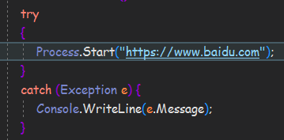

WPF 项目迁移到.Net Core中时居然出了一堆问题...(很无语)

今天在使用的时候居然发现`Process.Start`居然打不开Url链接了？ 报 找不到指定文件 的异常？！

## 一、bug重现
首先以.Net Core 3.1框架 中一个Console项目  打开百度为例:  

 运行然后你就会得到:  
 

 纳闷的是，这种方法打开Url在.Net Framework中是没问题的..  

## 二、解决方法
#### 方案一：使用windows系统自带的资源管理器来打开Url  
```csharp
Process.Start("explorer", "https://www.baidu.com");
```
你就可以得到一个浏览器窗口，打开着百度网页..  
但是如果你的Url复杂一点的话，例如打开百度搜索what  
```csharp
Process.Start("explorer", "https://www.baidu.com/s?wd=what");
explorer表示不干，并直接给你抛了个文件管理器窗口
```
所以这个方法只可以用于打开简单的URL...  

#### 方案二：使用cmd中的start命令 可以打开任意形式的URL
```csharp
string url = "https://www.baidu.com/s?wd=what";
Process p = new Process();
p.StartInfo.FileName = "cmd.exe";
p.StartInfo.UseShellExecute = false;    //不使用shell启动
p.StartInfo.RedirectStandardInput = true;//喊cmd接受标准输入
p.StartInfo.RedirectStandardOutput = false;//不想听cmd讲话所以不要他输出
p.StartInfo.RedirectStandardError = true;//重定向标准错误输出
p.StartInfo.CreateNoWindow = true;//不显示窗口
p.Start();

//向cmd窗口发送输入信息 后面的&exit告诉cmd运行好之后就退出
p.StandardInput.WriteLine("start "+url + "&exit");
p.StandardInput.AutoFlush = true;
p.WaitForExit();//等待程序执行完退出进程
p.Close();
```
OK  

 

以上的问题我只在Windows平台上找到过，不知Linux和OSX有没有...  

 

Thanks  
