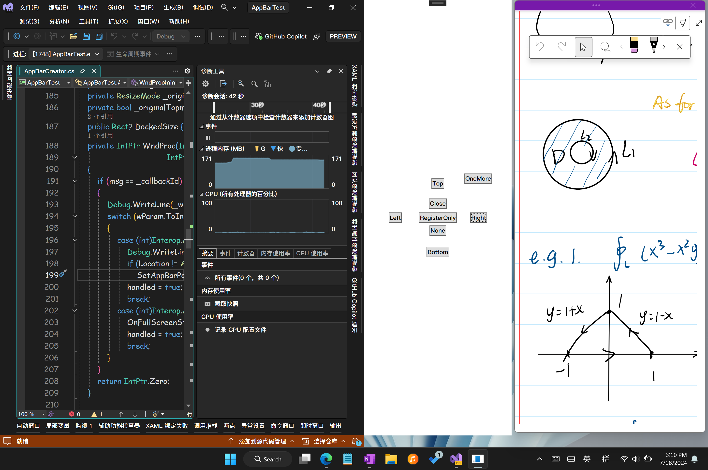
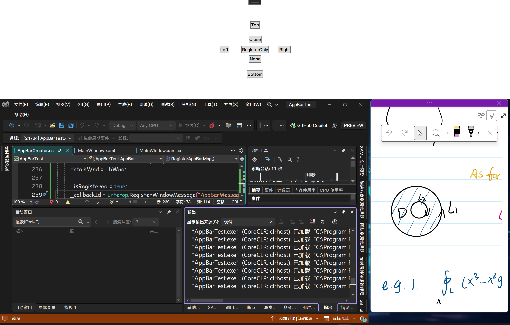
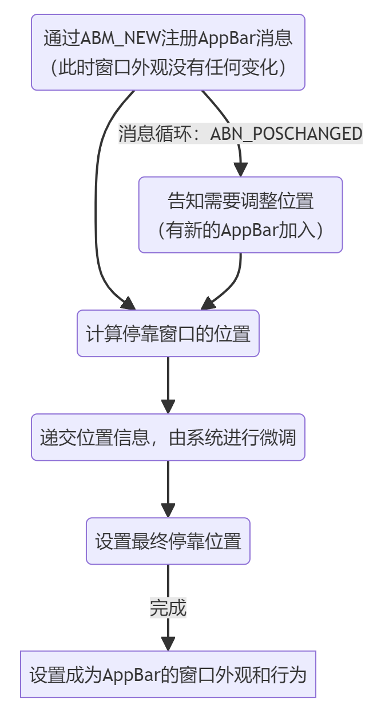
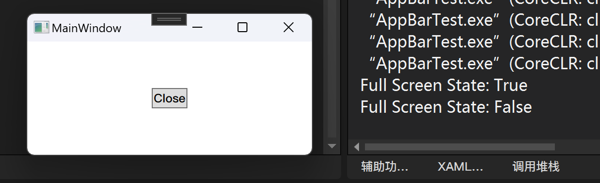
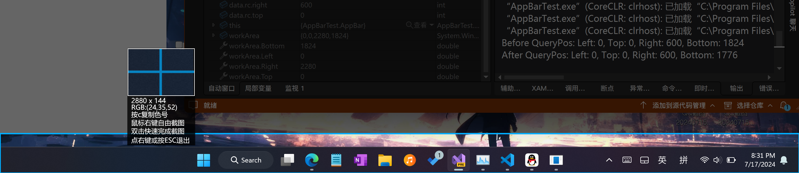
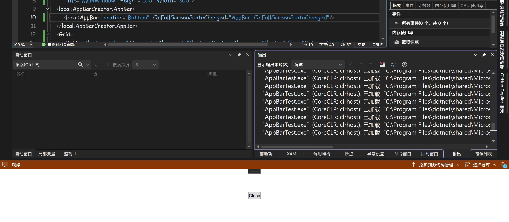

:::note[AppBar]
在吕毅大佬的文章中已经详细介绍了什么是:AppBar: [WPF 使用 AppBar 将窗口停靠在桌面上，让其他程序不占用此窗口的空间（附我封装的附加属性） - walterlv](https://blog.walterlv.com/post/dock-window-into-windows-desktop.html)   
即让窗口固定在屏幕某一边，并且保证其他窗口最大化后不会覆盖AppBar占据的区域（类似于Windows任务栏）。  
:::

但是在我的环境中测试时，上面的代码出现了一些问题，例如非100%缩放显示时的坐标计算异常、多窗口同时停靠时布局错乱等。所以我重写了AppBar在WPF上的实现，效果如图：  


## 一、AppBar的主要申请流程
主要流程如图：


（图注：ABN_POSCHANGED消息在任何需要调整位置之时都会触发，括号只是举个例子）  

核心代码其实在于如何计算停靠窗口的位置，要点是处理好一下几个方面：  

1. 修改停靠位置时用原窗口的大小计算，被动告知需要调整位置时用即时大小计算
2. 像素单位与WPF单位之间的转换
3. 小心Windows的位置建议，并排停靠时会得到负值高宽，需要手动适配对齐方式
4. 有新的AppBar加入时，窗口会被系统强制移动到工作区(WorkArea)，这点我还没能找到解决方案，只能把移动窗口的命令通过Dispatcher延迟操作
 

## 二、如何使用
1. 下载我封装好的库：[AppBarTest/AppBarCreator.cs at master · TwilightLemon/AppBarTest (github.com)](https://github.com/TwilightLemon/AppBarTest/blob/master/AppBarCreator.cs)
::github{repo="TwilightLemon/AppBarTest"}
2.  在xaml中直接设置：

```xml
<Window ...>

<local:AppBarCreator.AppBar>
    <local:AppBar x:Name="appBar" Location="Top" OnFullScreenStateChanged="AppBar_OnFullScreenStateChanged"/>
</local:AppBarCreator.AppBar>

...
</Window>
```

或者在后台创建：
```csharp
private readonly AppBar appBar=new AppBar();

...Window_Loaded...
appBar.Location = AppBarLocation.Top;
appBar.OnFullScreenStateChanged += AppBar_OnFullScreenStateChanged;
AppBarCreator.SetAppBar(this, appBar);
```

3. 另外你可能注意到了，这里有一个OnFullScreenStateChanged事件：该事件由AppBarMsg注册，在有窗口进入或退出全屏时触发，参数bool为true指示进入全屏。
你需要手动在事件中设置全屏模式下的行为，例如在全屏时隐藏AppBar  
```csharp
    private void AppBar_OnFullScreenStateChanged(object sender, bool e)
    {
        Debug.WriteLine("Full Screen State: "+e);
        Visibility = e ? Visibility.Collapsed : Visibility.Visible;
    }
```
我在官方的Flag上加了一个RegisterOnly，即只注册AppBarMsg而不真的停靠窗口，可以此用来作全屏模式监听。  

4. 如果你需要在每个虚拟桌面都显示AppBar(像任务栏那样)，可以尝试为窗口使用SetWindowLong添加WS_EX_TOOLWINDOW标签（自行查找）  

## 三、已知问题
1. 在我的github上的实例程序中，如果你将两个同进程的窗口并排叠放的话，会导致explorer和你的进程双双爆栈，windows似乎不能很好地处理这两个并排放置的窗口，一直在左右调整位置，疯狂发送ABN_POSCHANGED消息。(快去clone试试，死机了不要打我) 但是并排放置示例窗口和OneNote的Dock窗口就没有问题。

2.  计算停靠窗口时，如果选择停靠位置为Bottom，则系统建议的bottom位置值会比实际的高，测试发现是任务栏窗口占据了部分空间，应该是预留给平板模式的更大图标任务栏（猜测，很不合理的设计）

 自动隐藏任务栏就没有这个问题：

3. 没有实现自动隐藏AppBar，故没有处理与之相关的WM_ACTIVATE等消息，有需要的可以参考官方文档。（嘻 我懒）

## 参考文档：

> [SHAppBarMessage function (shellapi.h) - Win32 apps | Microsoft Learn](https://learn.microsoft.com/en-us/windows/win32/api/shellapi/nf-shellapi-shappbarmessage)

> [ABM_QUERYPOS message (Shellapi.h) - Win32 apps | Microsoft Learn](https://learn.microsoft.com/en-us/windows/win32/shell/abm-querypos) ABM_NEW & ABM_SETPOS etc..

> [使用应用程序桌面工具栏 - Win32 apps | Microsoft Learn](https://learn.microsoft.com/zh-cn/windows/win32/shell/application-desktop-toolbars)

> [判断是否有全屏程序正在运行（C#）_c# 判断程序当前窗口是否全屏如果是返回原来-CSDN博客](https://blog.csdn.net/jingzhongrong/article/details/5385951) 