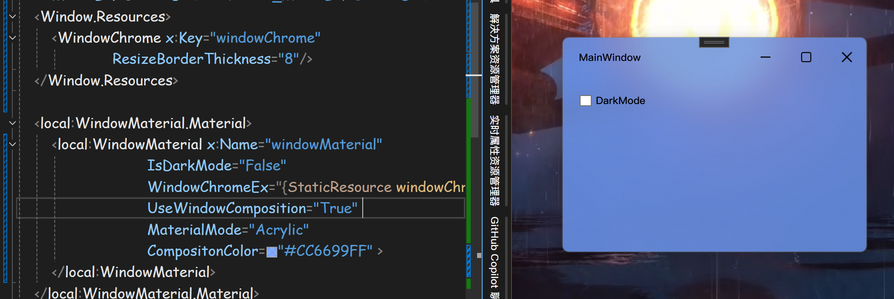

先看一下最终效果，左图为使用亚克力材质并添加组合颜色的效果；右图为MicaAlt材质的效果。两者都自定义了标题栏并且最大限度地保留了DWM提供的原生窗口效果（最大化最小化、关闭出现的动画、窗口阴影、拖拽布局器等）。接下来把各部分的实现一个个拆开来讲讲。



# 一、使用窗口材质特效
先粗略介绍一下目前win11和win10上的材质特效类型及一些特性：  

 - [Windows10 1903 ~ Windows11 lastest] ：Acrylic 亚克力材质 |  支持使用组合颜色 | 窗口失去焦点时不失效、有拖动窗口延迟 | API: `SetWindowCompositionAttribute`
> 1803版本开放此API 但是对Win32应用支持不好

 - Windows11:   API: `SetWindowAttribute` 其实现的材质特性：原生不支持组合颜色 对于非WindowStyle.None的窗口失焦失效 无拖动窗口延迟 提供了暗亮模式

    - `Acrylic` 亚克力材质  动态模糊，背景取决于窗口下方的内容
    - `Mica` 云母材质 背景仅取桌面壁纸(第三方动态壁纸软件无效)   颜色变化较为平缓   win11系统应用的窗口背景大部分使用此材质
    - `MicaAlt` 同Mica材质，区别是此材质的颜色变化更突出   文件管理器的标题栏使用此材质  

> 在win11上同样支持使用win10的SetWindowCompositionAttribute启用旧版API，只不过需要不同的使用条件

　前面的文章中介绍了在win11上启用材质的方法，但有不少弊端。之后诺尔大佬探究出从底层满足调用条件的方法，总结如下：

 1. 无论调用哪个API，都需要设置`AllowTransparency="True"`，弊端是带来性能问题和鼠标穿透(即使DWM已经绘制了底层颜色)，改为调用：
 ```csharp
 var hwndSource = (HwndSource)PresentationSource.FromVisual(_window);
 hwndSource.CompositionTarget.BackgroundColor = Colors.Transparent;
 ```
 2. `WindowChrome.GlassFrameThickness` 对于`SetWindowCompositionAttribute`需要值为`-1`，另一者则需要为`0`，弊端是可能我们并不需要WindowsChrome来拓展整个客户区，改为调用`DwmExtendFrameIntoClientArea`，详细见后文示例程序。

　　如果你想动手实现一下，可以参照：[[.NET,WPF] 窗体云母, 亚克力, 透明, 混合颜色, 模糊背景, 亮暗色主题全讲 (slimenull.com)](https://slimenull.com/posts/20240530104846/)

## 下面给出我封装好的附加属性：
[WindowEffectTest/WindowEffectTest/WindowMaterial.cs at master · TwilightLemon/WindowEffectTest (github.com)](https://github.com/TwilightLemon/WindowEffectTest/blob/master/WindowEffectTest/WindowMaterial.cs)

　　使用方法很简单，在你的xaml中添加以下作为Window的子标签，并且将Window.Background设为Transparent.
```xml
<local:WindowMaterial.Material>
        <local:WindowMaterial x:Name="windowMaterial" 
                              IsDarkMode="True" 
                              UseWindowComposition="False" 
                              MaterialMode="MicaAlt" 
                              CompositonColor="#CC6699FF" >
        </local:WindowMaterial>
</local:WindowMaterial.Material>
```
属性解释： 
- `IsDarkMode`: 暗色模式，主要对`Mica(Alt)`材质生效
- `UseWindowComposition`: 在win10上无效，指示使用`SetWindowCompositionAttribute`，在win11上启用旧版的亚克力特效，一般用于创建无边框窗口的背景材质，此属性为`True`时会忽略`MaterialMode`
- `MaterialMode`: 指示使用的材质类型 `None` / `Acrylic` / `Mica` / `MicaAlt`
- `CompositionColor`: 指示使用混合颜色的值，仅对`MaterialMode`=`Acrylic`(直接设置`Window.Background`) 和 使用`SetWindowCompositionAttribute`时有效

幸运的话可以得到以下效果：

如果尝试使用亚克力材质并设置混合色的话，无论使用哪个API都会得到类似的效果：

区别在于：如果使用SetWindowAttribute提供的亚克力材质，可以调整IsDarkMode来配置背景色，但是效果不是很好。


## 使用附加的WindowChromeEx来将客户区拓展至标题栏
> 如果`WindowChrome`直接附加在窗口上会覆盖掉我们设置的`GlassFrameThickness`，故这里的设计是将`WindowChrome`附加在`WindowMaterial`上进行管理。你可以接着使用熟悉的`WindowChrome`提供的属性，然后把它作为资源提供给`WindowMaterial.WindowChromeEx`属性。

```xml
<Window.Resources>
        <WindowChrome x:Key="windowChrome" ResizeBorderThickness="8"/>
    </Window.Resources>
    
<local:WindowMaterial.Material>
    <local:WindowMaterial x:Name="windowMaterial" 
                          IsDarkMode="True" 
                          UseWindowComposition="False"
                          WindowChromeEx="{StaticResource windowChrome}"
                          MaterialMode="Acrylic" 
                          CompositonColor="#CC6699FF" >
    </local:WindowMaterial>
</local:WindowMaterial.Material>
```
然后就能得到：

MicaAlt (DarkMode) 以及 使用 WindowComposition 的亚克力材质效果：


# 二、自定义标题栏并保留DWM动画
　　简单地介绍以下我的实现： 在Windows所以窗口创建底层都是走的WinAPI，WPF也不例外。可以通过仅提供`WS_CAPTION`标签来创建一个没有三大按钮的标题栏：
```csharp
[DllImport("user32.dll", EntryPoint = "SetWindowLong")]
private static extern int SetWindowLong32(HandleRef hWnd, int nIndex, int dwNewLong);

[DllImport("user32.dll", EntryPoint = "SetWindowLongPtr")]
private static extern IntPtr SetWindowLongPtr64(HandleRef hWnd, int nIndex, IntPtr dwNewLong);

public const int GWL_STYLE = -16;
public const long WS_CAPTION = 0x00C00000L;

public static IntPtr SetWindowLongPtr(HandleRef hWnd, int nIndex, IntPtr dwNewLong)
            => IntPtr.Size == 8
            ? SetWindowLongPtr64(hWnd, nIndex, dwNewLong)
            : new IntPtr(SetWindowLong32(hWnd, nIndex, dwNewLong.ToInt32()));

public static void EnableDwmAnimation(Window w)
{
    var myHWND = new WindowInteropHelper(w).Handle;
    IntPtr myStyle = new(WS_CAPTION);
    SetWindowLongPtr(new HandleRef(null, myHWND), GWL_STYLE, myStyle);
}
```

然后按照上述的方法添加WindowChrome让客户区覆盖标题栏即可。 （这里提前绘制好了自定义的标题栏样式，你需要自行处理暗色模式的变化等等）


这样`WindowStyle`就会失效，并且在实现`WindowStyle.None`的效果同时带上`WS_CAPTION`标签让DWM认为这是一个“原生”标题栏窗口。经过测试，另外还需加上`WS_THICKFRAME|WS_MAXIMIZEBOX|WS_MINIMIZEBOX` 等标签让窗口行为更贴近原生。（添加`WS_THICKFRAME`在移动窗口时出现系统的窗口布局器）

同样失效的还有`ResizeMode.NoResize`，如果你需要固定窗口大小，目前暂行的方法是设置`WindowsChrome`的`ResizeBorderThickness="0"`，如果按照WinAPI的方法加上WS_SYSMENU则会同时带回原生标题栏的三大按钮。（为什么微软对它的解释是标题栏菜单..?）

### 使用我封装好的附加属性：
[WindowEffectTest/WindowEffectTest/DwmAnimation.cs at master · TwilightLemon/WindowEffectTest (github.com)](https://github.com/TwilightLemon/WindowEffectTest/blob/master/WindowEffectTest/DwmAnimation.cs)

在Window标签中添加：（同样地这会使`WindowStyle`和`ResizeMode`失效）
```xml
local:DwmAnimation.EnableDwmAnimation="True"
```
# 三、添加更多窗口行为
以下Demo使用了诺尔大佬的WPF Suite来帮助简化流程。

### Demo 1. 创建一个失焦不失效的亚克力材质圆角窗口 (Win11)，所有设置如下：


关键部分在`ws:WindowOption.Corner="Round"`这一句，始终使用圆角窗口，并且拥有原生边框阴影 （右图为对照，无阴影）

手动实现参照官方文档：[Apply rounded corners in desktop apps - Windows apps | Microsoft Learn](https://learn.microsoft.com/zh-cn/windows/apps/desktop/modernize/ui/apply-rounded-corners)

### Demo 2. 添加win11的布局器

在Button中添加 `ws:WindowOption.IsMaximumButton="True"` 以在鼠标悬停时显示布局器


-------------------
本文的所有效果均可通过诺尔大佬的WPF Suite快速实现，大家快去用呀！

[Documentation | EleCho.WpfSuite](https://wpfsuite.elecho.dev/)


### 最后附上测试项目地址：  
::github{repo="TwilightLemon/WindowEffectTest"}

参考文章：
> [在 Windows 11 应用中使用的材料 - Windows apps | Microsoft Learn](https://learn.microsoft.com/zh-cn/windows/apps/design/signature-experiences/materials)

> [[.NET,WPF] 窗体云母, 亚克力, 透明, 混合颜色, 模糊背景, 亮暗色主题全讲 (slimenull.com)](https://slimenull.com/posts/20240530104846/)

> [WPF在win10/11上启用模糊特效 适配Dark/Light Mode - TwilightLemon - 博客园 (cnblogs.com)](https://www.cnblogs.com/TwilightLemon/p/17479921.html)

 ......