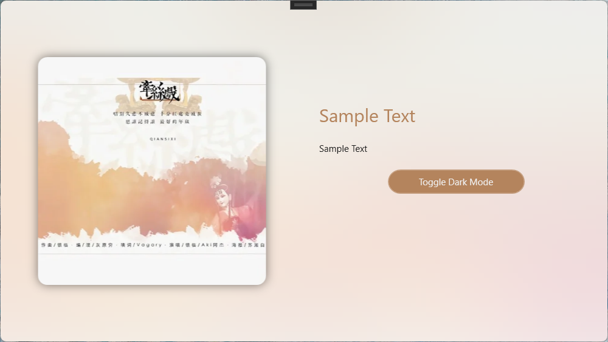
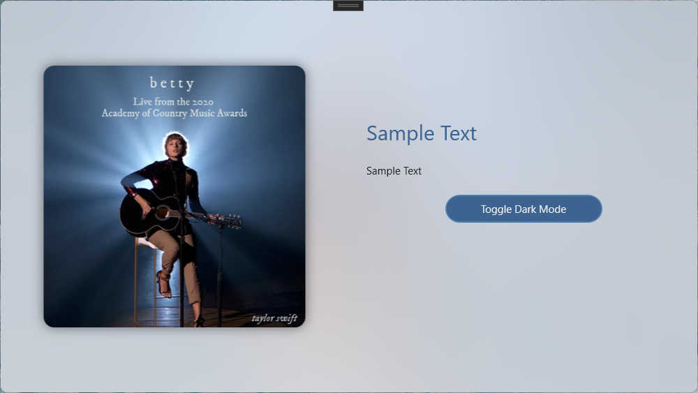
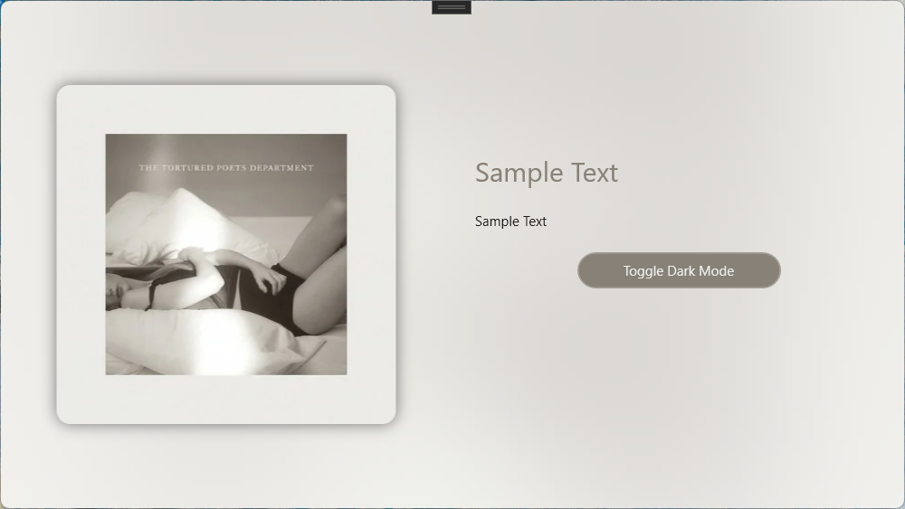
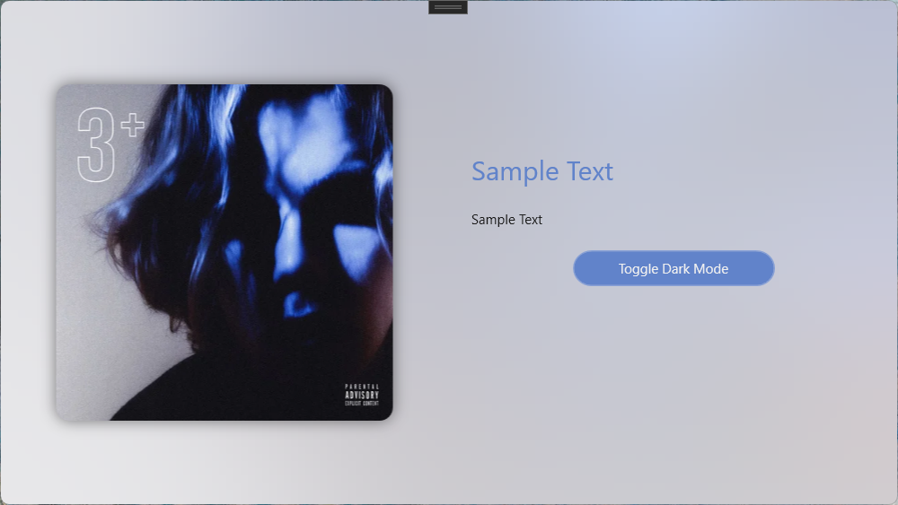
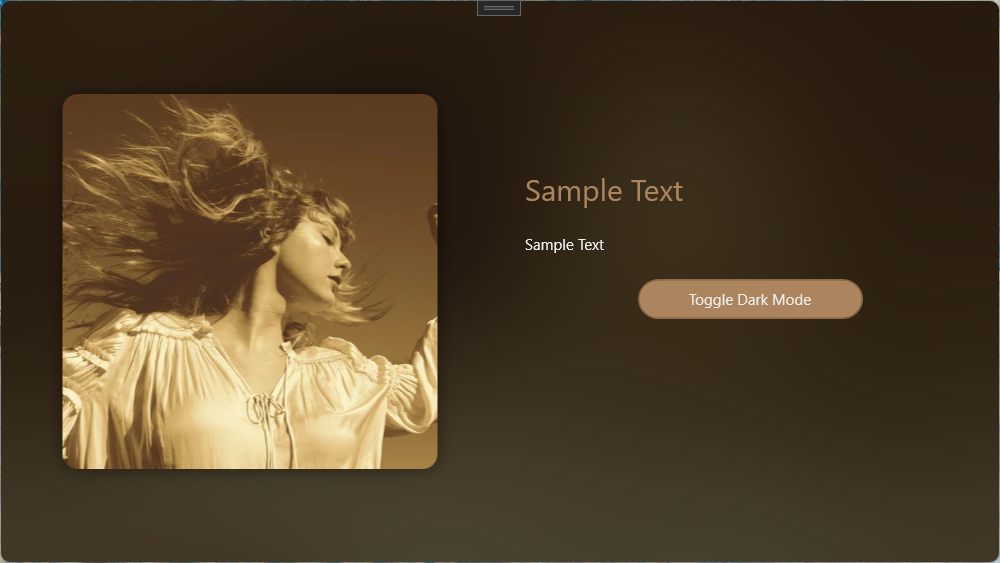
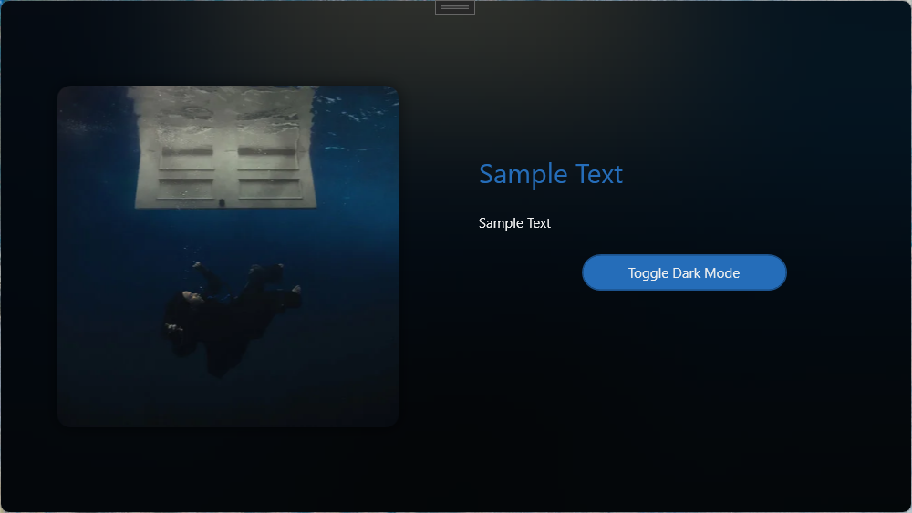
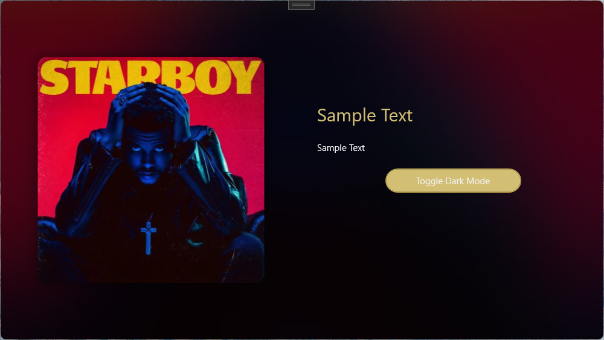

先看效果，在浅色模式下：  




在深色模式下：




> _P.S. 此算法只是尽可能地接近Windows Mica效果，并非实际实现；主色调提取算法只能确保在绝大多数情况下适用。_

测试项目在Github上开源:  
::github{repo="TwilightLemon/MicaImageTest"}

# 一、简要原理和设计
## 1.1 Mica效果
Mica效果是Windows 11的一个新特性，旨在为应用程序提供一种更柔和的背景效果。它通过使用桌面壁纸的颜色和纹理来创建一个静态的模糊背景效果。一个大致的模拟过程如下：  

1. 根据颜色模式(浅色或深色)来调整图像对比度
2. 增加一个白色/黑色的遮罩层
3. 大半径 高斯模糊处理

在仓库代码中给出了所有组件的实现，如果你想调整效果，可以修改以下几个值：
```csharp
public static void ApplyMicaEffect(this Bitmap bitmap,bool isDarkmode)
{
    bitmap.AdjustContrast(isDarkmode?-1:-20);//Light Mode通常需要一个更高的对比度
    bitmap.AddMask(isDarkmode);//添加遮罩层
    bitmap.ScaleImage(2);//放大图像(原始图像一般为500x500)以提高输出图像质量
    var rect = new Rectangle(0, 0, bitmap.Width, bitmap.Height);
    bitmap.GaussianBlur(ref rect, 80f, false);//按需要调整模糊半径
}
```

## 1.2 主色调提取与微调
从原始图像中提取主色调，主要过程如下：  

1. 像素采样和颜色量化便于统计
2. 过滤过黑或过白的颜色值(我们会在调整步骤单独处理)
3. 根据HSL的饱和度和亮度来计算权重，
   - 饱和度越高，权重越大
   - 亮度稳定（我们定为0.6），权重越大
4. 选择权重最大的颜色均值作为主色调

之后为了适配UI，保证亮度、饱和度适合用于呈现内容，还要对颜色进行微调： 

1. 将颜色转为HSL空间
2. 根据颜色模式调节亮度
3. 分层调整饱和度，一般来说暗色模式的对比度比亮色模式高
3. 对特定色相区间（红/绿/蓝/黄）进行差异化调整

最后计算焦点颜色（FocusAccentColor）只需要根据颜色模式调整亮度即可。

# 二、使用方法
将代码仓库中的`ImageHelper.cs`添加到项目，然后在需要的地方调用`Bitmap`的扩展方法来处理图像。以下是一个简单的示例：

首先开启项目允许使用UnSafe代码：
```xml
  <PropertyGroup>
    <!-- 允许使用UnSafe代码 -->
    <AllowUnsafeBlocks>true</AllowUnsafeBlocks>
  </PropertyGroup>  
```
导入本地图像文件，计算主色调、焦点色调并应用Mica效果背景：
```csharp
 var image=new BitmapImage(new Uri(ImagePath));
 SelectedImg = image;
 var bitmap = image.ToBitmap();
 //major color
 var majorColor = bitmap.GetMajorColor().AdjustColor(IsDarkMode);
 var focusColor = majorColor.ApplyColorMode(IsDarkMode);
 App.Current.Resources["AccentColor"] = new SolidColorBrush(majorColor);
 App.Current.Resources["FocusedAccentColor"] = new SolidColorBrush(focusColor);
 //background
 bitmap.ApplyMicaEffect(IsDarkMode);
 BackgroundImg = bitmap.ToBitmapImage();
```
其中，`SelectedImg`和`BackgroundImg`是绑定到UI的`BitmapImage`类型属性，`IsDarkMode`是指示当前颜色模式的布尔值。

# 三、注意事项
1. 处理大图像时可能会导致性能下降，建议使用较小的图像或在后台线程中处理。
2. 如果高斯模糊组件报错，请确保Nuget包`System.Drawing.Common`的版本为`8.0.1`，因为代码中使用了反射获取`Bitmap`内部的句柄。
3. 你可能需要根据实际情况调整模糊半径和对比度等参数，以获得最佳效果。
4. 库中实现可能并非最佳写法，如果有更好的方法可以提交PR或者评论区见。

最后附上`ImageHelper.cs`的完整代码
```csharp
using System.Drawing;
using System.Drawing.Drawing2D;
using System.Drawing.Imaging;
using System.IO;
using System.Reflection;
using System.Runtime.InteropServices;
using System.Windows.Media.Imaging;

namespace MicaImageTest;

public static class ImageHelper
{
    #region 处理模糊图像
    [DllImport("gdiplus.dll", SetLastError = true, ExactSpelling = true, CharSet = CharSet.Unicode)]
    private static extern int GdipBitmapApplyEffect(IntPtr bitmap, IntPtr effect, ref Rectangle rectOfInterest, bool useAuxData, IntPtr auxData, int auxDataSize);
    /// <summary>
    /// 获取对象的私有字段的值
    /// </summary>
    /// <typeparam name="TResult">字段的类型</typeparam>
    /// <param name="obj">要从其中获取字段值的对象</param>
    /// <param name="fieldName">字段的名称.</param>
    /// <returns>字段的值</returns>
    /// <exception cref="System.InvalidOperationException">无法找到该字段.</exception>
    /// 
    internal static TResult GetPrivateField<TResult>(this object obj, string fieldName)
    {
        if (obj == null) return default(TResult);
        Type ltType = obj.GetType();
        FieldInfo lfiFieldInfo = ltType.GetField(fieldName, BindingFlags.GetField | BindingFlags.Instance | BindingFlags.NonPublic);
        if (lfiFieldInfo != null)
            return (TResult)lfiFieldInfo.GetValue(obj);
        else
            throw new InvalidOperationException(string.Format("Instance field '{0}' could not be located in object of type '{1}'.", fieldName, obj.GetType().FullName));
    }

    [StructLayout(LayoutKind.Sequential)]
    private struct BlurParameters
    {
        internal float Radius;
        internal bool ExpandEdges;
    }
    [DllImport("gdiplus.dll", SetLastError = true, ExactSpelling = true, CharSet = CharSet.Unicode)]
    private static extern int GdipCreateEffect(Guid guid, out IntPtr effect);
    private static Guid BlurEffectGuid = new Guid("{633C80A4-1843-482B-9EF2-BE2834C5FDD4}");
    [DllImport("gdiplus.dll", SetLastError = true, ExactSpelling = true, CharSet = CharSet.Unicode)]
    private static extern int GdipSetEffectParameters(IntPtr effect, IntPtr parameters, uint size);
    public static IntPtr NativeHandle(this Bitmap Bmp)
    {
        // 通过反射获取Bitmap的私有字段nativeImage的值，该值为GDI+的内部图像句柄
        //新版(8.0.1)Drawing的Nuget包中字段由 nativeImage变更为_nativeImage
        return Bmp.GetPrivateField<IntPtr>("_nativeImage");
    }
    [DllImport("gdiplus.dll", SetLastError = true, ExactSpelling = true, CharSet = CharSet.Unicode)]
    private static extern int GdipDeleteEffect(IntPtr effect);
    public static void GaussianBlur(this Bitmap Bmp, ref Rectangle Rect, float Radius = 10, bool ExpandEdge = false)
    {
        int Result;
        IntPtr BlurEffect;
        BlurParameters BlurPara;
        if ((Radius < 0) || (Radius > 255))
        {
            throw new ArgumentOutOfRangeException("半径必须在[0,255]范围内");
        }
        BlurPara.Radius = Radius;
        BlurPara.ExpandEdges = ExpandEdge;
        Result = GdipCreateEffect(BlurEffectGuid, out BlurEffect);
        if (Result == 0)
        {
            IntPtr Handle = Marshal.AllocHGlobal(Marshal.SizeOf(BlurPara));
            Marshal.StructureToPtr(BlurPara, Handle, true);
            GdipSetEffectParameters(BlurEffect, Handle, (uint)Marshal.SizeOf(BlurPara));
            GdipBitmapApplyEffect(Bmp.NativeHandle(), BlurEffect, ref Rect, false, IntPtr.Zero, 0);
            // 使用GdipBitmapCreateApplyEffect函数可以不改变原始的图像，而把模糊的结果写入到一个新的图像中
            GdipDeleteEffect(BlurEffect);
            Marshal.FreeHGlobal(Handle);
        }
        else
        {
            throw new ExternalException("不支持的GDI+版本，必须为GDI+1.1及以上版本，且操作系统要求为Win Vista及之后版本.");
        }
    }
    #endregion

    public static System.Windows.Media.Color GetMajorColor(this Bitmap bitmap)
    {
        int skip = Math.Max(1, Math.Min(bitmap.Width, bitmap.Height) / 100);

        Dictionary<int, ColorInfo> colorMap = [];
        int pixelCount = 0;

        for (int h = 0; h < bitmap.Height; h += skip)
        {
            for (int w = 0; w < bitmap.Width; w += skip)
            {
                Color pixel = bitmap.GetPixel(w, h);

                // 量化颜色 (减少相似颜色的数量)
                int quantizedR = pixel.R / 16 * 16;
                int quantizedG = pixel.G / 16 * 16;
                int quantizedB = pixel.B / 16 * 16;

                // 排除极端黑白色
                int averange = (pixel.R + pixel.G + pixel.B) / 3;
                if (averange < 24) continue;
                if (averange > 230) continue;

                int colorKey = (quantizedR << 16) | (quantizedG << 8) | quantizedB;

                if (colorMap.TryGetValue(colorKey, out ColorInfo info))
                {
                    info.Count++;
                    info.SumR += pixel.R;
                    info.SumG += pixel.G;
                    info.SumB += pixel.B;
                }
                else
                {
                    colorMap[colorKey] = new ColorInfo
                    {
                        Count = 1,
                        SumR = pixel.R,
                        SumG = pixel.G,
                        SumB = pixel.B
                    };
                }
                pixelCount++;
            }
        }

        if (pixelCount == 0 || colorMap.Count == 0)
            return System.Windows.Media.Colors.Gray;

        var weightedColors = colorMap.Values.Select(info =>
        {
            float r = info.SumR / (float)info.Count / 255f;
            float g = info.SumG / (float)info.Count / 255f;
            float b = info.SumB / (float)info.Count / 255f;

            // 转换为HSL来检查饱和度和亮度
            RgbToHsl(r, g, b, out float h, out float s, out float l);

            // 颜色越饱和越有可能是主色调，过亮或过暗的颜色权重降低
            float weight = info.Count * s * (1 - Math.Abs(l - 0.6f) * 1.8f);

            return new
            {
                R = info.SumR / info.Count,
                G = info.SumG / info.Count,
                B = info.SumB / info.Count,
                Weight = weight
            };
        })
        .OrderByDescending(c => c.Weight);

        if (weightedColors.First() is { } dominantColor)
        {
            // 取权重最高的颜色
            return System.Windows.Media.Color.FromRgb(
                (byte)dominantColor.R,
                (byte)dominantColor.G,
                (byte)dominantColor.B);
        }

        return System.Windows.Media.Colors.Gray;
    }

    private class ColorInfo
    {
        public int Count { get; set; }
        public int SumR { get; set; }
        public int SumG { get; set; }
        public int SumB { get; set; }
    }

    public static System.Windows.Media.Color AdjustColor(this System.Windows.Media.Color col, bool isDarkMode)
    {
        // 转换为HSL色彩空间，便于调整亮度和饱和度
        RgbToHsl(col.R / 255f, col.G / 255f, col.B / 255f, out float h, out float s, out float l);

        bool isNearGrayscale = s < 0.15f; // 判断是否接近灰度

        // 1. 基于UI模式进行初步亮度调整
        if (isDarkMode)
        {
            // 在暗色模式下，避免颜色过暗，提高整体亮度
            if (l < 0.5f)
                l = 0.3f + l * 0.5f;

            if (isNearGrayscale)
                l = Math.Max(l, 0.4f); // 确保足够明亮
        }
        else
        {
            // 在亮色模式下，避免颜色过亮，降低整体亮度
            if (l > 0.5f)
                l = 0.3f + l * 0.4f;

            if (isNearGrayscale)
                l = Math.Min(l, 0.6f); // 确保不过亮
        }

        // 2. 调整饱和度
        if (!isNearGrayscale)
        {
            if (s > 0.7f)
            {
                // 高饱和度降低，但是暗色模式需要更鲜明的颜色
                s = isDarkMode ? 0.7f - (s - 0.7f) * 0.2f : 0.65f - (s - 0.7f) * 0.4f;
            }
            else if (s > 0.4f)
            {
                // 中等饱和度微调
                s = isDarkMode ? s * 0.85f : s * 0.75f;
            }
            else if (s > 0.1f) // 低饱和度但不是接近灰度
            {
                // 低饱和度增强，尤其在暗色模式下
                s = isDarkMode ? Math.Min(0.5f, s * 1.5f) : Math.Min(0.4f, s * 1.3f);
            }
        }

        // 3. 特殊色相区域的处理
        if (!isNearGrayscale) // 仅处理有明显色相的颜色
        {
            // 红色区域 (0-30° 或 330-360°)
            if ((h <= 0.08f) || (h >= 0.92f))
            {
                if (isDarkMode)
                {
                    // 暗色模式下红色需要更高饱和度和亮度
                    s = Math.Min(0.7f, s * 1.1f);
                    l = Math.Min(0.8f, l * 1.15f);
                }
                else
                {
                    // 亮色模式下红色降低饱和度，避免刺眼
                    s *= 0.8f;
                    l = Math.Max(0.4f, l * 0.9f);
                }
            }
            // 绿色区域 (90-150°)
            else if (h >= 0.25f && h <= 0.42f)
            {
                if (isDarkMode)
                {
                    // 暗色模式下绿色提高亮度，降低饱和度，避免荧光感
                    s *= 0.85f;
                    l = Math.Min(0.7f, l * 1.2f);
                }
                else
                {
                    // 亮色模式下绿色降低饱和度更多
                    s *= 0.75f;
                }
            }
            // 蓝色区域 (210-270°)
            else if (h >= 0.58f && h <= 0.75f)
            {
                if (isDarkMode)
                {
                    // 暗色模式下蓝色提高亮度和饱和度
                    s = Math.Min(0.85f, s * 1.2f);
                    l = Math.Min(0.7f, l * 1.25f);
                }
                else
                {
                    // 亮色模式下蓝色保持中等饱和度
                    s = Math.Min(0.7f, Math.Max(0.4f, s));
                }
            }
            // 黄色区域 (30-90°)
            else if (h > 0.08f && h < 0.25f)
            {
                if (isDarkMode)
                {
                    // 暗色模式下黄色需要降低饱和度，提高亮度
                    s *= 0.8f;
                    l = Math.Min(0.75f, l * 1.2f);
                }
                else
                {
                    // 亮色模式下黄色大幅降低饱和度
                    s *= 0.7f;
                    l = Math.Max(0.5f, l * 0.9f);
                }
            }
        }


        // 5. 最终亮度修正 - 确保在各种UI模式下都有足够的对比度
        if (isDarkMode && l < 0.3f) l = 0.3f; // 暗色模式下确保最小亮度
        if (!isDarkMode && l > 0.7f) l = 0.7f; // 亮色模式下确保最大亮度

        // 转换回RGB
        HslToRgb(h, s, l, out float r, out float g, out float b);

        // 确保RGB值在有效范围内
        byte R = (byte)Math.Max(0, Math.Min(255, r * 255));
        byte G = (byte)Math.Max(0, Math.Min(255, g * 255));
        byte B = (byte)Math.Max(0, Math.Min(255, b * 255));

        return System.Windows.Media.Color.FromRgb(R, G, B);
    }
    public static System.Windows.Media.Color ApplyColorMode(this System.Windows.Media.Color color,bool isDarkMode)
    {
        RgbToHsl(color.R/255f,color.G/255f, color.B/255f,out float h, out float s, out float l);
        if (isDarkMode)
            l = Math.Max(0.05f, l - 0.1f);
        else
            l = Math.Min(0.95f, l + 0.1f);

        HslToRgb(h, s, l, out float r, out float g, out float b);
        return System.Windows.Media.Color.FromRgb((byte)(r * 255), (byte)(g * 255), (byte)(b * 255));
    }

    private static void RgbToHsl(float r, float g, float b, out float h, out float s, out float l)
    {
        float max = Math.Max(r, Math.Max(g, b));
        float min = Math.Min(r, Math.Min(g, b));

        // 计算亮度
        l = (max + min) / 2.0f;

        // 默认值初始化
        h = 0;
        s = 0;

        if (max == min)
        {
            // 无色调 (灰色)
            return;
        }

        float d = max - min;

        // 计算饱和度
        s = l > 0.5f ? d / (2.0f - max - min) : d / (max + min);

        // 计算色相
        if (max == r)
        {
            h = (g - b) / d + (g < b ? 6.0f : 0.0f);
        }
        else if (max == g)
        {
            h = (b - r) / d + 2.0f;
        }
        else // max == b
        {
            h = (r - g) / d + 4.0f;
        }

        h /= 6.0f;

        // 确保h在[0,1]范围内
        h = Math.Max(0, Math.Min(1, h));
    }

    private static void HslToRgb(float h, float s, float l, out float r, out float g, out float b)
    {
        // 确保h在[0,1]范围内
        h = ((h % 1.0f) + 1.0f) % 1.0f;

        // 确保s和l在[0,1]范围内
        s = Math.Max(0, Math.Min(1, s));
        l = Math.Max(0, Math.Min(1, l));

        if (s == 0.0f)
        {
            // 灰度颜色
            r = g = b = l;
            return;
        }

        float q = l < 0.5f ? l * (1.0f + s) : l + s - l * s;
        float p = 2.0f * l - q;

        r = HueToRgb(p, q, h + 1.0f / 3.0f);
        g = HueToRgb(p, q, h);
        b = HueToRgb(p, q, h - 1.0f / 3.0f);
    }

    private static float HueToRgb(float p, float q, float t)
    {
        // 确保t在[0,1]范围内
        t = ((t % 1.0f) + 1.0f) % 1.0f;

        if (t < 1.0f / 6.0f)
            return p + (q - p) * 6.0f * t;
        if (t < 0.5f)
            return q;
        if (t < 2.0f / 3.0f)
            return p + (q - p) * (2.0f / 3.0f - t) * 6.0f;
        return p;
    }
    public static BitmapImage ToBitmapImage(this Bitmap Bmp)
    {
        BitmapImage BmpImage = new();
        using (MemoryStream lmemStream = new())
        {
            Bmp.Save(lmemStream, ImageFormat.Png);
            BmpImage.BeginInit();
            BmpImage.StreamSource = new MemoryStream(lmemStream.ToArray());
            BmpImage.EndInit();
        }
        return BmpImage;
    }

    public static Bitmap ToBitmap(this BitmapImage img){
        using MemoryStream outStream = new();
        BitmapEncoder enc = new PngBitmapEncoder();
        enc.Frames.Add(BitmapFrame.Create(img));
        enc.Save(outStream);
        return new Bitmap(outStream);
    }

    public static void AddMask(this Bitmap bitmap,bool darkmode)
    {
        var color1 = darkmode ? Color.FromArgb(150, 0, 0, 0) : Color.FromArgb(160, 255, 255, 255);
        var color2 = darkmode ? Color.FromArgb(180, 0, 0, 0) : Color.FromArgb(200, 255, 255, 255);
        using Graphics g = Graphics.FromImage(bitmap);
        using LinearGradientBrush brush = new(
            new Rectangle(0, 0, bitmap.Width, bitmap.Height),
            color1,
            color2,
            LinearGradientMode.Vertical);
        g.FillRectangle(brush, new Rectangle(0, 0, bitmap.Width, bitmap.Height));
    }
    public static void AdjustContrast(this Bitmap bitmap, float contrast)
    {
        contrast = (100.0f + contrast) / 100.0f;
        contrast *= contrast;

        BitmapData data = bitmap.LockBits(new Rectangle(0, 0, bitmap.Width, bitmap.Height),
            ImageLockMode.ReadWrite, bitmap.PixelFormat);

        int width = bitmap.Width;
        int height = bitmap.Height;

        unsafe
        {
            for (int y = 0; y < height; y++)
            {
                byte* row = (byte*)data.Scan0 + (y * data.Stride);
                for (int x = 0; x < width; x++)
                {
                    int idx = x * 3;

                    float blue = row[idx] / 255.0f;
                    float green = row[idx + 1] / 255.0f;
                    float red = row[idx + 2] / 255.0f;

                    // 转换为HSL
                    RgbToHsl(red, green, blue, out float h, out float s, out float l);

                    // 调整亮度以增加对比度
                    l = (((l - 0.5f) * contrast) + 0.5f);

                    // 转换回RGB
                    HslToRgb(h, s, l, out red, out green, out blue);

                    row[idx] = (byte)Math.Max(0, Math.Min(255, blue * 255.0f));
                    row[idx + 1] = (byte)Math.Max(0, Math.Min(255, green * 255.0f));
                    row[idx + 2] = (byte)Math.Max(0, Math.Min(255, red * 255.0f));
                }
            }
        }

        bitmap.UnlockBits(data);
    }

    public static void ScaleImage(this Bitmap bitmap, double scale)
    {
        // 计算新的尺寸
        int newWidth = (int)(bitmap.Width * scale);
        int newHeight = (int)(bitmap.Height * scale);

        // 创建目标位图
        Bitmap newBitmap = new Bitmap(newWidth, newHeight, bitmap.PixelFormat);

        // 设置高质量绘图参数
        using (Graphics graphics = Graphics.FromImage(newBitmap))
        {
            graphics.CompositingQuality = CompositingQuality.HighQuality;
            graphics.InterpolationMode = InterpolationMode.HighQualityBicubic;
            graphics.SmoothingMode = SmoothingMode.HighQuality;
            graphics.PixelOffsetMode = PixelOffsetMode.HighQuality;

            // 绘制缩放后的图像
            graphics.DrawImage(bitmap,
                new Rectangle(0, 0, newWidth, newHeight),
                new Rectangle(0, 0, bitmap.Width, bitmap.Height),
                GraphicsUnit.Pixel);
        }
        bitmap = newBitmap;
    }

    public static void ApplyMicaEffect(this Bitmap bitmap,bool isDarkmode)
    {
        bitmap.AdjustContrast(isDarkmode?-1:-20);
        bitmap.AddMask(isDarkmode);
        bitmap.ScaleImage(2);
        var rect = new Rectangle(0, 0, bitmap.Width, bitmap.Height);
        bitmap.GaussianBlur(ref rect, 80f, false);
    }
}

```