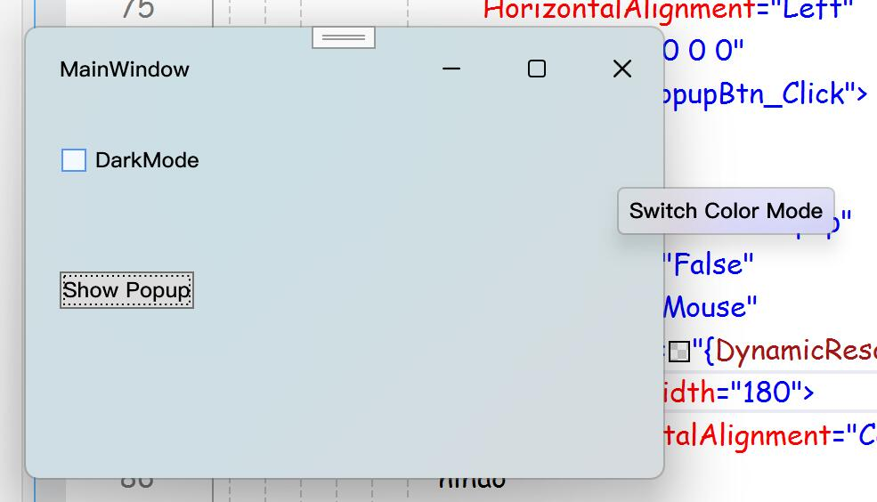
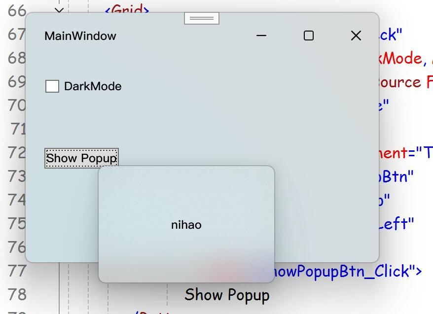

先看效果图：



大致思路是：通过反射获取`Popup`内部的`原生窗口句柄`，然后通过前文已经实现的`WindowMaterial`类来应用窗口特效；对于`ToolTip`，为了保持其易用性，我使用了`附加属性+全局样式`的方式来实现，`ToolTip`也是一个特殊的`Popup`.  
前文链接：[WPF 模拟UWP原生窗口样式——亚克力|云母材质、自定义标题栏样式、原生DWM动画 （附我封装好的类）](/posts/window-material-in-wpf)  
本文的Demo：  
::github{repo="TwilightLemon/WindowEffectTest"}


## 一、获取原生窗口句柄
通过查阅.NET源码得知，Popup内部通过一个类型为`PopupSecurityHelper`的私有字段`_secHelper`来管理窗口`hWnd`，并且在创建完成之时会触发`Popup.Opened`事件。  
通过反射来获取窗口句柄:
```csharp
const BindingFlags privateInstanceFlag = BindingFlags.NonPublic | BindingFlags.Instance;
public static IntPtr GetNativeWindowHwnd(this Popup popup)
{
    //获取Popup内部的_secHelper字段Info
    var field = typeof(Popup).GetField("_secHelper", privateInstanceFlag);
    if (field != null)
    {
        //获取popup的_secHelper字段值
        if (field.GetValue(popup) is { } _secHelper)
        {
            //获取_secHelper的Handle属性Info
            if (_secHelper.GetType().GetProperty("Handle", privateInstanceFlag) is { } prop)
            {
                if (prop.GetValue(_secHelper) is IntPtr handle)
                {
                    //返回句柄
                    return handle;
                }
            }
        }
    }
    //未找到
    return IntPtr.Zero;
}
```
同样地，能在`ToolTip`内部找到私有字段`_parentPopup`
```csharp
public static IntPtr GetNativeWindowHwnd(this ToolTip tip)
{
    var field=tip.GetType().GetField("_parentPopup", privateInstanceFlag);
    if (field != null)
    {
        if(field.GetValue(tip) is Popup{ } popup)
        {
            return popup.GetNativeWindowHwnd();
        }
    }
    return IntPtr.Zero;
}
```

## 二、应用WindowMaterial特效
有了窗口句柄那么一切都好办了，直接调用我封装好的`WindowMaterial`类，如果你想了解更多请查看前文。  
```csharp
public static void SetPopupWindowMaterial(IntPtr hwnd,Color compositionColor,
     MaterialApis.WindowCorner corner= MaterialApis.WindowCorner.Round)
{
    if (hwnd != IntPtr.Zero)
    {
        int hexColor = compositionColor.ToHexColor();
        var hwndSource = HwndSource.FromHwnd(hwnd);
        //----
        MaterialApis.SetWindowProperties(hwndSource, 0);
        MaterialApis.SetWindowComposition(hwnd, true, hexColor);
        //----
        MaterialApis.SetWindowCorner(hwnd, corner);
    }
}
```
根据微软的设计规范，这里默认对普通Popup使用圆角，对ToolTip使用小圆角，使用亚克力材质并附加compositionColor。  
在github中获取完整的WindowMaterial.cs，我可能会不定期地更新它：[WindowEffectTest/WindowMaterial.cs at master · TwilightLemon/WindowEffectTest (github.com)](https://github.com/TwilightLemon/WindowEffectTest/blob/master/WindowEffectTest/WindowMaterial.cs)  

如果你想使用Mica或MicaAlt等材质则将上面框起来的代码替换为：
```csharp
MaterialApis.SetWindowProperties(hwndSource, -1);
MaterialApis.SetBackDropType(hwnd, MaterialType.Mica);
MaterialApis.SetDarkMode(hwnd, isDarkMode: true);
```

## 三、没错我又封装了一个即开即用的类
在Demo中查看封装好的类：[WindowEffectTest/FluentPopup.cs at master · TwilightLemon/WindowEffectTest (github.com)](https://github.com/TwilightLemon/WindowEffectTest/blob/master/WindowEffectTest/FluentPopup.cs)  
#### 使用FluentPopup
```xml
<local:FluentPopup x:Name="testPopup"
                   StaysOpen="False"
                   Placement="Mouse"
                   Background="{DynamicResource PopupWindowBackground}">
    <Grid Height="120" Width="180">
        <TextBlock HorizontalAlignment="Center" VerticalAlignment="Center">
            nihao 
        </TextBlock>
    </Grid>
</local:FluentPopup>
```
其中，`Background`属性是我自定义的一个依赖属性，只允许使用`SolidColorBrush`，用于设置亚克力特效的CompositionColor。  
如果你希望像Demo中那样让Popup失焦自动关闭，可以设置`StaysOpen`为`False`，在后台打开Popup时使用：  
```csharp
private async void ShowPopupBtn_Click(object sender, RoutedEventArgs e)
{
    await Task.Yield();
    testPopup.IsOpen = true;
}
```
关于为什么要加上`await Task.Tield()`，可以看看吕毅大佬的文章:[一点点从坑里爬出来：如何正确打开 WPF 里的 Popup？ - Walterlv](https://blog.walterlv.com/post/how-to-open-a-wpf-popup.html)

#### 在全局内使用FluentToolTip
我自定义了一个附加属性`FluentTooltip.UseFluentStyle`，你只需要在App.xaml中设置即可全局生效：
这里的`PopupWindowBackground`和`ForeColor`是我自定义的颜色资源，你可以根据自己的需要来设置。  
同样地`Background`仅支持`SolidColorBrush`。
```xml
<Style TargetType="{x:Type ToolTip}">
    <Setter Property="local:FluentTooltip.UseFluentStyle"
            Value="True" />
    <Setter Property="Background"
            Value="{DynamicResource PopupWindowBackground}" />
    <Setter Property="Foreground"
            Value="{DynamicResource ForeColor}" />
</Style>
```
这样你就可以方便地创建一个Fluent风格的ToolTip了：
```xml
<Button 
    ToolTip="xxxxx"
    />
```


## 参考链接

> [Popup.cs at Dotnet Source](https://source.dot.net/#PresentationFramework/System/Windows/Controls/Primitives/Popup.cs,0dde044d24b22b3c)

> [ToolTip.cs at Dotnet Source](https://source.dot.net/#PresentationFramework/System/Windows/Controls/ToolTip.cs,3920316e3b8e4b74)

> [一点点从坑里爬出来：如何正确打开 WPF 里的 Popup？ - Walterlv](https://blog.walterlv.com/post/how-to-open-a-wpf-popup.html)

> [WPF 模拟UWP原生窗口样式——亚克力|云母材质、自定义标题栏样式、原生DWM动画 （附我封装好的类） - TwilightLemon](/posts/window-material-in-wpf) 